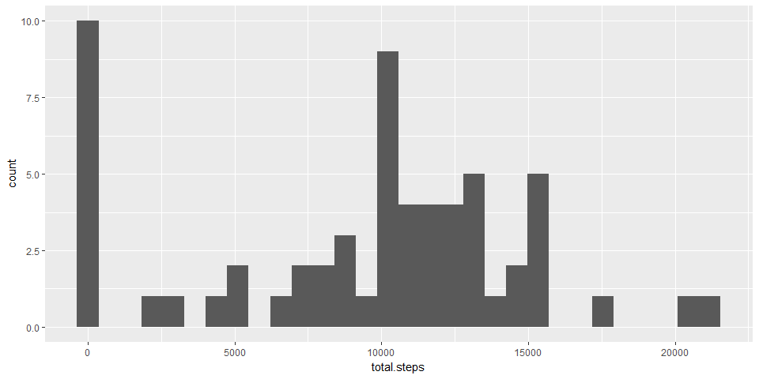
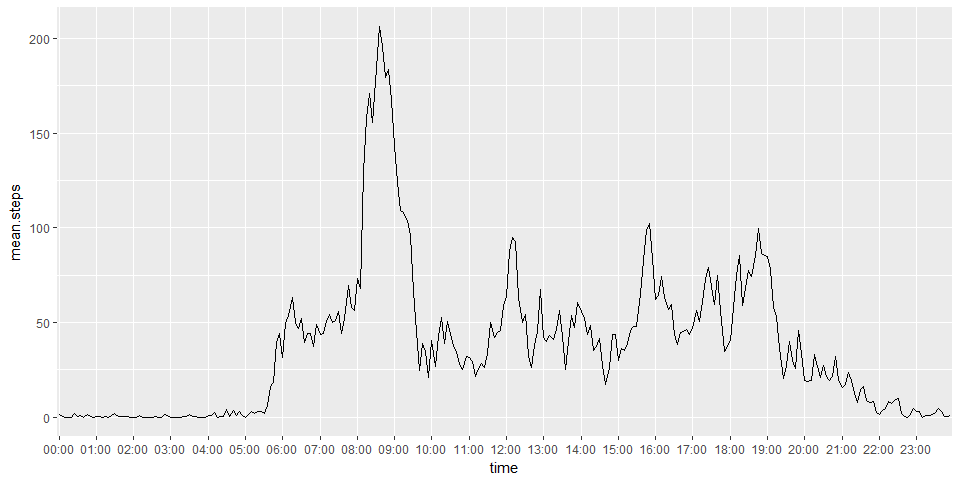
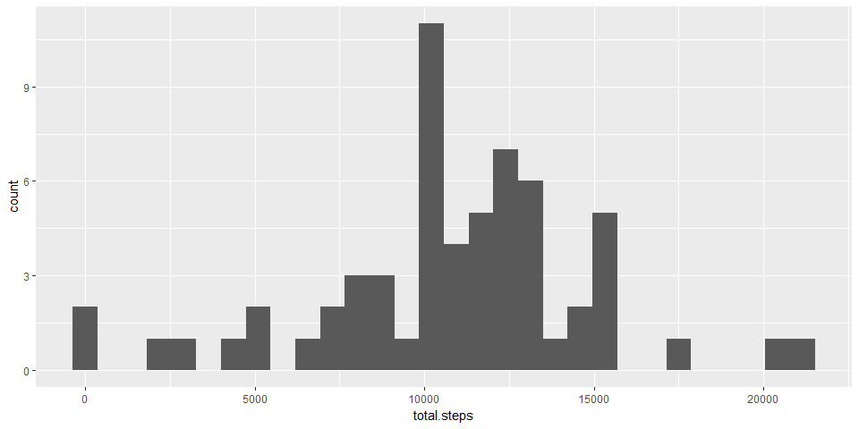
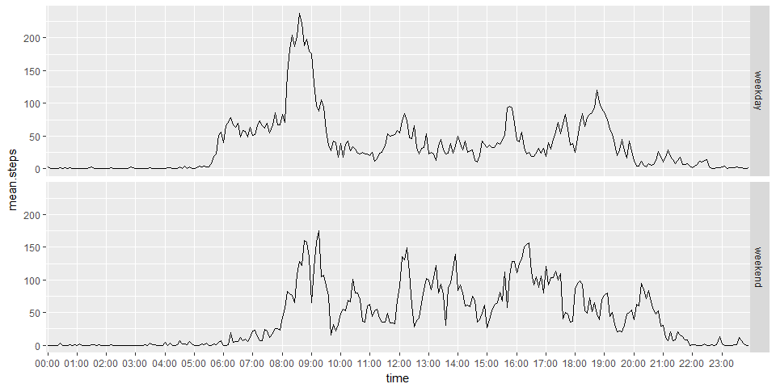

# Reproducible Research: Peer Assessment 1
Rafael Daniel  
13 de enero de 2017  


# Loading and preprocessing the data
The data for this analysis is downloaded from this [link](https://d396qusza40orc.cloudfront.net/repdata%2Fdata%2Factivity.zip).
Date is converted to Date data type and weekday in English is included as a factor for further analysis. Interval code is converted to time HH:MM.

```r
  myzipfile<-tempfile()
  download.file(url="https://d396qusza40orc.cloudfront.net/repdata%2Fdata%2Factivity.zip",destfile = myzipfile, mode="wb")
  con<-unzip(zipfile=myzipfile,files = "activity.csv")
  data<-read.csv(file=con)
  
  data$date<-as.Date(data$date,"%Y-%m-%d")  # convert date as Date
  
  Sys.setlocale("LC_TIME","English")        # set local time in English
```

```
## [1] "English_United States.1252"
```

```r
  data$day<-as.factor(weekdays(data$date))  # include the day of the week as a factor
  
  data$time<-formatC(data$interval, width = 4, format = "d", flag = "0")
  data$time<-as.factor(paste0(substring(data$time,1,2),":",substring(data$time,3,4)))
```

# What is mean total number of steps taken per day?
To calculate de number of steps per day the data is grouped by date and all the intervals of each day are added
After that we can calculate de mean and the median for each date.


```r
require(dplyr)
daily.data<-group_by(data,date)%>%summarise(total.steps=sum(steps,na.rm = T))%>%ungroup()
summarise(daily.data,mean=mean(total.steps), median=median(total.steps))
```

```
## # A tibble: 1 × 2
##      mean median
##     <dbl>  <int>
## 1 9354.23  10395
```
This is the histogram of the total number of steps taken each day

```r
require(ggplot2)
ggplot(data = daily.data,aes(total.steps))+geom_histogram()
```

<!-- -->

# What is the average daily activity pattern?

1. Make a time series plot (i.e. type = "l") of the 5-minute interval (x-axis) and the average number of steps taken, averaged across all days (y-axis)


```r
require(dplyr)
require(ggplot2)
interval.data<-group_by(data,time,interval)%>%summarise(mean.steps=mean(steps,na.rm=T))


dayhours<-paste0(formatC(0:23,width = 2,format = "d",flag=0),":00")
ggplot(data=interval.data,aes(x=time,y=mean.steps,group=1))+geom_line()+scale_x_discrete(breaks=dayhours)
```

<!-- -->

2. Which is the interval with the maximum number of steps?


```r
 interval.data[which.max(interval.data$mean.steps),]
```

```
## Source: local data frame [1 x 3]
## Groups: time [1]
## 
##     time interval mean.steps
##   <fctr>    <int>      <dbl>
## 1  08:35      835   206.1698
```

# Imputing missing values

1. Calculate and report the total number of missing values in the dataset (i.e. the total number of rows with NAs)


```r
sum(is.na(data$steps)) #number of intervals with NA values
```

```
## [1] 2304
```
2. Devise a strategy for filling in all of the missing values in the dataset. The strategy does not need to be sophisticated. For example, you could use the mean/median for that day, or the mean for that 5-minute interval, etc.

As we are interested in patterns during the week we will replace the missing data with the average interval value of the week day.

3. Create a new dataset that is equal to the original dataset but with the missing data filled in.

data.filled dataset is created using the strategy to fill the NA data.

```r
# Calculate de mean value for each interval and day of the week
weekday.intervals<-group_by(data,day,interval)%>%summarise(mean.steps=mean(steps,na.rm = T))

#subset the NA intervals of the orginal data
data.NA<-data[is.na(data$steps),]

#merge with weekdays.intervals rows were day and interval are the same
data.NA<-merge(x = data.NA,y=weekday.intervals,all.x = T)

#discard step values (NA) and rename mean.steps as steps
data.NA<-select(data.NA,-steps)%>%rename(steps=mean.steps)

#add the modifies values witht the original ones in a new data frame
data.filled<-rbind.data.frame(data.NA,data[!is.na(data$steps),])
```

4. Make a histogram of the total number of steps taken each day and Calculate and report the mean and median total number of steps taken per day. Do these values differ from the estimates from the first part of the assignment? What is the impact of imputing missing data on the estimates of the total daily number of steps?

After filling the missing data the mean and the median of the number of steps by day increase.

```r
require(dplyr)
# for each date calculate the total number of steps as a sum
daily.data.filled<-group_by(data.filled,date)%>%summarise(total.steps=sum(steps,na.rm = T))%>%ungroup()

# calculate the mean and the median of steps per day
summarise(daily.data.filled,mean=mean(total.steps), median=median(total.steps))
```

```
## # A tibble: 1 × 2
##       mean median
##      <dbl>  <dbl>
## 1 10821.21  11015
```


```r
require(ggplot2)
ggplot(data = daily.data.filled,aes(total.steps))+geom_histogram()
```

<!-- -->

# Are there differences in activity patterns between weekdays and weekends?

Data.filled data set is modified by adding the day type (weekday/weekend) as a factor

```r
# function daytype returns weekend or weekday depending of the input day
daytype<-function(day){ 
  weekend<-c("Saturday","Sunday")
  if (day %in% weekend){
    type<-"weekend"
  }else{
    type<-"weekday"
  }
  type
}

# apply daytype to all days of the data set and add as a new factor
data.filled$type<-sapply(data.filled$day,daytype)
data.filled$type<-as.factor(data.filled$type)
```

Plot comparing weekdays and weekend  activity patterns

```r
data.filled.intervals<-group_by(data.filled, time,type)%>%summarise(mean.steps=mean(steps))
ggplot(data=data.filled.intervals,aes(x=time,y=mean.steps,group=1))+geom_line()+facet_grid(type~.)+scale_x_discrete(breaks=dayhours)
```

<!-- -->

